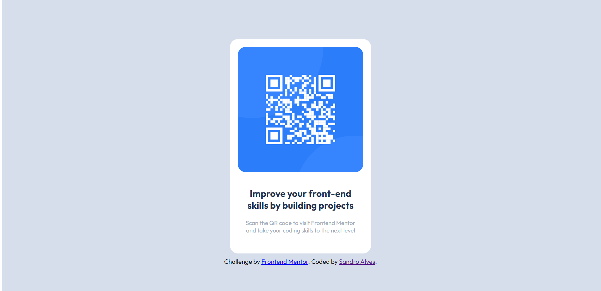

# Frontend Mentor - QR code component solution

This is a solution to the [QR code component challenge on Frontend Mentor](https://www.frontendmentor.io/challenges/qr-code-component-iux_sIO_H). 
 

## Table of contents

- [Overview](#overview)
  - [Screenshot](#screenshot)
  - [Links](#links)
- [My process](#my-process)
  - [Built with](#built-with)
  - [What I learned](#what-i-learned)
- [Author](#author)

## Overview

This is a simple project to replicate a page with a QR code component and make it look just like the original in every aspect.

### Screenshot

### Links

- Solution URL: [Add solution URL here](https://your-solution-url.com)

## My process

Basicaly the process took 2 steps:

First I built the general tags I wanted to use (section, divs and footer) giving their Id's and then I filled them with the content.

Then, I started styling with CSS and reload the browser while comparing it with the model.

### Built with

- Semantic HTML5 markup
- CSS custom properties

### What I learned

This challenge was useful to reinforce my knowledge on image manipulation. 

## Author

- Frontend Mentor - [@yourusername](https://www.frontendmentor.io/profile/SandroAlvez)

